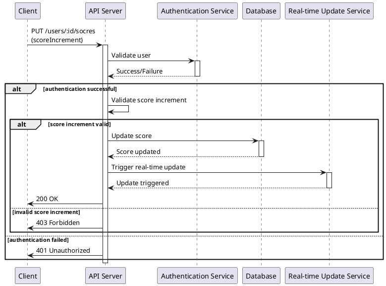

# Problem 4
---

## Iterative Solution
```typescript
const sum_to_n2 = (n: number): number => {
    let sum = 0;
    for (let i = 1; i <= n; i++) {
        sum += i;
    }
    return sum;
}
```
**Complexity**: This approach has a time complexity of O(n) because it involves a loop that iterates n times. The space complexity is O(1), as it uses a fixed amount of space regardless of the input size.
### Pros
**Simplicity**: The iterative approach is straightforward and easy to understand, especially for beginners learning about loops.

**Flexibility**: This method can be easily modified for variations, such as summing only even numbers or applying certain conditions to the elements being summed.

### Cons
**Efficiency**: Although the time complexity is linear (O(n)), it may not be the most efficient approach for very large values of n as it requires iterating through all numbers from 1 to n.

**Scalability**: As n increases, the time it takes to compute the sum also increases linearly, which might not be optimal for large-scale problems.

## Recursive Solution
```typescript
const sum_to_n3 = (n: number): number => {
    if (n === 1) {
        return 1;
    }
    return n + sum_to_n3(n - 1);
}
```
**Complexity**: The recursive approach has a time complexity of O(n) because it makes n recursive calls until it reaches the base case. The space complexity is also O(n) due to the call stack size that grows linearly with the number of recursive calls. While elegant, this method is less efficient for large n due to the overhead of recursive calls and potential risk of stack overflow.

### Pros
**Conceptual Elegance**: Recursive solutions can be more elegant and closer to a mathematical definition of a problem (such as factorial or Fibonacci numbers).

**Adaptability**: Recursive approaches can be easily adapted for related problems that require breaking down the problem into smaller chunks, such as tree traversals.

### Cons
**Memory Usage**: Recursion requires additional memory for the call stack. In JavaScript and TypeScript, which do not optimize tail recursion, this can lead to stack overflow for large n.
**Performance**: Recursive methods have a linear time complexity (O(n)) and can be slower compared to the formula approach due to the overhead of multiple function calls.
**Complexity for Debugging**: Debugging recursive functions can be more challenging due to the function calls being stacked and more complex execution flow.

## Formula-Based Solution
```typescript
const sum_to_n = (n: number): number => {
    return n * (n + 1) / 2;
}
```
**Complexity**: This approach uses the formula for the sum of the first n natural numbers. The time and space complexity are both O(1), making it the most efficient of the three methods. It's a direct computation without any iteration or recursion, and it requires a constant amount of space.

### Pros

**Performance**: This method offers the best performance with a constant time complexity (O(1)), making it very fast regardless of the size of n.

**Simplicity**: The formula is concise and eliminates the need for loops or recursion, which can simplify coding and reduce the potential for bugs.

### Cons

**Applicability**: The formula approach only works for a straightforward sum of consecutive numbers. It lacks the flexibility to be easily adapted to more complex summation conditions without significant changes.

**Understanding**: For those new to programming or mathematics, the reasoning behind the formula may not be as immediately intuitive as iterative or recursive approaches.

## Benchmarking
```typescript
const benchmark = (fn: (n: number) => number, n: number): void => {
    const start = process.hrtime();
    const result = fn(n);
    const end = process.hrtime(start);
    console.log(`Result: ${result}, Time: ${end[0]}s ${end[1] / 1e6}ms`);
}
```

### Prerequisites
- Node.js v18.18.2
- TypeScript v5.4.5
- Mac M1 Memory 32GB

### Conclusion
- With samples n = 10000, the formula-based approach is the fastest, followed by the iterative approach. The recursive approach is the slowest and throws a stack overflow error for large values of n.
- The iterative approach is the most straightforward and efficient for this problem, with a linear time complexity of O(n) and constant space complexity of O(1).
- The Recursive approach is elegant but less efficient due to the overhead of multiple function calls and potential stack overflow for large n. It happens error for n = 10000. Maximum call stack size exceeded.
```
Testing Formula Approach
Result: 50005000, Time: 0s 0.005417ms
Testing Iterative Approach
Result: 50005000, Time: 0s 0.164916ms
Testing Recursive Approach
/Users/cong.nguyen/Documents/99tech/nguyen_thanh_cong/src/problem4/build/index.js:31
    if (n === 1) {
    ^

RangeError: Maximum call stack size exceeded
    at sum_to_n3 (/Users/cong.nguyen/Documents/99tech/nguyen_thanh_cong/src/problem4/build/index.js:31:5)
    at sum_to_n3 (/Users/cong.nguyen/Documents/99tech/nguyen_thanh_cong/src/problem4/build/index.js:34:16)
    at sum_to_n3 (/Users/cong.nguyen/Documents/99tech/nguyen_thanh_cong/src/problem4/build/index.js:34:16)
    at sum_to_n3 (/Users/cong.nguyen/Documents/99tech/nguyen_thanh_cong/src/problem4/build/index.js:34:16)
    at sum_to_n3 (/Users/cong.nguyen/Documents/99tech/nguyen_thanh_cong/src/problem4/build/index.js:34:16)
    at sum_to_n3 (/Users/cong.nguyen/Documents/99tech/nguyen_thanh_cong/src/problem4/build/index.js:34:16)
    at sum_to_n3 (/Users/cong.nguyen/Documents/99tech/nguyen_thanh_cong/src/problem4/build/index.js:34:16)
    at sum_to_n3 (/Users/cong.nguyen/Documents/99tech/nguyen_thanh_cong/src/problem4/build/index.js:34:16)
    at sum_to_n3 (/Users/cong.nguyen/Documents/99tech/nguyen_thanh_cong/src/problem4/build/index.js:34:16)
    at sum_to_n3 (/Users/cong.nguyen/Documents/99tech/nguyen_thanh_cong/src/problem4/build/index.js:34:16)
```

## How do I run the code?
- Clone the repository
- Navigate to the problem4 directory
- Run the following commands:
```bash
npm install
npm run build
npm run start
```

# Problem 5
---

## Pre-requisite
- Node.js v18.18.2
- TypeScript v5.4.5
- Express v4.19.2
- docker v20.10.11
- docker-compose v1.29.2
- mongodb v4.4.11

## How to run the code?
- Clone the repository
- Navigate to the problem5 directory
- Run the following commands:
```bash
docker-compose up -d
```

## API Endpoints
`BASE_URL`: `http://localhost:8080/v1`

### Create
- **POST** `/products`
- **Request Body**:
```json
{
  "name": "string",
  "price": "number",
  "stock": "number",
  "description": "string",
  "category": "string",
  "image": "string"
}
```
- **Response**: 200 HTPP OK
```json
{
  "message": "string",
  "data": {
    "id": "string",
    "name": "string",
    "price": "number",
    "stock": "number",
    "description": "string",
    "category": "string",
    "image": "string",
    "createdAt": "string",
    "updatedAt": "string",
    "__v": "number"
  }
}
```

#### Example

**cURL request**
```
curl --location 'http://localhost:8080/v1/products' \
--header 'Content-Type: application/json' \
--data '{
    "name": "Sữa Chua",
    "price": 20000,
    "stock": 1000,
    "description": "Sản xuất theo công nghệ châu âu",
    "category": "Milk",
    "image": "https://cdn.tgdd.vn/2021/08/CookRecipe/Avatar/sua-chua-yaourt-thumbnail.jpg"
}'
```

**Response**
```
{
    "message": "Product created",
    "data": {
        "name": "Sữa Chua",
        "price": 20000,
        "description": "Sản xuất theo công nghệ châu âu",
        "category": "Milk",
        "stock": 1000,
        "image": "https://cdn.tgdd.vn/2021/08/CookRecipe/Avatar/sua-chua-yaourt-thumbnail.jpg",
        "status": "active",
        "deleted": false,
        "updatedAt": "2024-04-13T09:13:27.169Z",
        "createdAt": "2024-04-13T09:13:27.169Z",
        "id": "Ts3qYjDIT"
    }
}
```

### Update
- **PUT** `/products/:id`
- Parameters:
  - `id`: string Product ID
- **Request Body**:
```json
{
  "name": "string",
  "price": "number",
  "stock": "number",
  "description": "string",
  "category": "string",
  "image": "string"
}
```

- **Response**: 200 HTPP OK
```json
{
  "message": "string",
  "data": {
    "id": "string",
    "name": "string",
    "price": "number",
    "stock": "number",
    "description": "string",
    "category": "string",
    "image": "string",
    "createdAt": "string",
    "updatedAt": "string",
    "__v": "number"
  }
}
```

#### Example

**cURL**
```
curl --location --request PUT 'http://localhost:8080/v1/products/CJAE8tgtq' \
--header 'Content-Type: application/json' \
--data '{
    "name": "Sữa Chua",
    "price": 20000,
    "stock": 1000,
    "desctiption": "Sản xuất theo công nghệ châu âu",
    "category": "Sữa",
    "image": "https://cdn.tgdd.vn/2021/08/CookRecipe/Avatar/sua-chua-yaourt-thumbnail.jpg"
}'
```

**Response**
```json
{
    "message": "Product updated",
    "data": {
        "name": "Sữa Chua",
        "price": 20000,
        "description": "Sản xuất theo công nghệ châu âu",
        "category": "Sữa",
        "stock": 1000,
        "image": "https://cdn.tgdd.vn/2021/08/CookRecipe/Avatar/sua-chua-yaourt-thumbnail.jpg",
        "status": "active",
        "deleted": false,
        "updatedAt": "2024-04-13T09:13:27.169Z",
        "createdAt": "2024-04-13T09:13:27.169Z",
        "id": "Ts3qYjDIT"
    }
}
```

### Delete
- **DELETE** `/products/:id`
- Parameters:
  - `id`: string Product ID
  - **Response**: 200 HTPP OK
  ```json
    {
    "message": "string",
    "data": {
        "name": "string",
        "price": number,
        "description": "string",
        "category": "string",
        "stock": number,
        "image": "string",
        "status": "string",
        "deleted": boolean,
        "updatedAt": "string", // ISO8601
        "createdAt": "string", // ISO8601
        "id": "aw3v7nqjL"
    }
}
```

#### Example

**cURL**
```
curl --location --request DELETE 'http://localhost:8080/v1/products/aw3v7nqjL'
```

**Response**
```json
{
    "message": "Product deleted",
    "data": {
        "name": "Sữa Chua",
        "price": 20000,
        "description": "Sản xuất theo công nghệ châu âu",
        "category": "Sữa",
        "stock": 1000,
        "image": "https://cdn.tgdd.vn/2021/08/CookRecipe/Avatar/sua-chua-yaourt-thumbnail.jpg",
        "status": "inactive",
        "deleted": true,
        "updatedAt": "2024-04-13T09:13:27.169Z",
        "createdAt": "2024-04-13T09:13:27.169Z",
        "id": "Ts3qYjDIT"
    }
}
```

### Get All
- **GET** `/products`
- **Parameters**:
  - `page`: number Page number
  - `limit`: number Number of items per page
- **Response**: 200 HTPP OK
```json
{
  "message": "string",
  "data": {
    "docs": [
      {
        "name": "string",
        "price": "number",
        "category": "string",
        "stock": "number",
        "image": "string",
        "status": "string",
        "updatedAt": "string",
        "createdAt": "string",
        "id": "string"
      }
    ],
    "totalDocs": "number",
    "limit": "number",
    "totalPages": "number",
    "page": "number",
    "pagingCounter": "number",
    "hasPrevPage": "boolean",
    "hasNextPage": "boolean",
    "prevPage": null,
    "nextPage": null
  }
}
```

#### Example

**cURL**
```
curl --location --request GET 'http://localhost:3000/v1/products?page=1&limit=100' \
--header 'Content-Type: application/json' \
--data '{
    "name": "Sữa Chua",
    "price": 20000,
    "stock": 1000,
    "desctiption": "Sản xuất theo công nghệ châu âu",
    "category": "Sữa",
    "image": "https://cdn.tgdd.vn/2021/08/CookRecipe/Avatar/sua-chua-yaourt-thumbnail.jpg"
}'
```

**Response**
```json
{
    "message": "Products found",
    "data": {
        "docs": [
            {
                "name": "Sữa Chua",
                "price": 20000,
                "description": "Sản xuất theo công nghệ châu âu",
                "category": "Sữa",
                "stock": 1000,
                "image": "https://cdn.tgdd.vn/2021/08/CookRecipe/Avatar/sua-chua-yaourt-thumbnail.jpg",
                "status": "active",
                "deleted": false,
                "updatedAt": "2024-04-13T09:13:27.169Z",
                "createdAt": "2024-04-13T09:13:27.169Z",
                "id": "Ts3qYjDIT"
            }
        ],
        "totalDocs": 1,
        "limit": 100,
        "totalPages": 1,
        "page": 1,
        "pagingCounter": 1,
        "hasPrevPage": false,
        "hasNextPage": false,
        "prevPage": null,
        "nextPage": null
    }
}
```

### Get By ID
- **GET** `/products/:id`
- Parameters:
  - `id`: string Product ID
- **Response**: 200 HTPP OK
```json
{
  "message": "string",
  "data": {
    "name": "string",
    "price": "number",
    "category": "string",
    "stock": "number",
    "image": "string",
    "status": "string",
    "updatedAt": "string",
    "createdAt": "string",
    "id": "string"
  }
}
```

#### Example

**cURL**
```
curl --location --request GET 'http://localhost:8080/v1/products/Ts3qYjDIT'
```

**Response**
```json
{
    "message": "Product found",
    "data": {
        "name": "Sữa Chua",
        "price": 20000,
        "description": "Sản xuất theo công nghệ châu âu",
        "category": "Sữa",
        "stock": 1000,
        "image": "https://cdn.tgdd.vn/2021/08/CookRecipe/Avatar/sua-chua-yaourt-thumbnail.jpg",
        "status": "active",
        "deleted": false,
        "updatedAt": "2024-04-13T09:13:27.169Z",
        "createdAt": "2024-04-13T09:13:27.169Z",
        "id": "Ts3qYjDIT"
    }
}
```

**Note**: after running the code, you can import the Postman collection in the `postman` directory to test the API endpoints.
[product.postman_collection.json](postman%2Fproduct.postman_collection.json)

# Problem 6
---
## Diagram - Execution Flow


## UML Diagram PlantUML


1. **User (Client) initiates action:** The sequence begins with the user completing an action that affects their score.
2. **API Request:** The client sends a PUT request to `/users/:id/scores` with the user ID and score increment.
3. **API Server receives request:** The server processes the request.
4. **Authentication:** The server requests the authentication service to verify the user's identity.
5. **Authentication Service:** Validates the credentials and returns success or failure.
6. **Validation:** If authenticated, the server validates the score increment.
7. **Database Update:** Upon successful validation, the server updates the score in the database.
8. **Real-time Update:** The server then triggers a real-time update to the live scoreboard using WebSockets, AppSync or SSE.
9. **Response to Client:** Finally, the server sends a response back to the client indicating the result of the operation (success or error).

### API Service Module for Live Scoreboard Update
This documentation provides an overview of the API service module designed to update and maintain a live scoreboard for a website. The scoreboard displays the top 10 user scores and updates in real time as users complete certain actions that affect their scores.

#### Features
**Live Score Update**: The scoreboard updates in real time to reflect the scores of the top 10 users.
**User Score Update**: Users can increase their scores through certain actions. An API call is dispatched to the server upon the completion of such actions.
**Security**: Implementations are in place to prevent unauthorized score manipulation.

**Endpoints**
PUT /users/:id/scores
**Description**: Updates the user's score and refreshes the live scoreboard.
- **Request Body:**
```json
{
  "scoreIncrement": "integer"
}
```
- **Response:**
  - 200 OK: Score updated successfully.
  - 401 Unauthorized: User authentication failed.
  - 403 Forbidden: Score update request rejected due to suspicious activity.

- **Security**: This endpoint uses OAuth2 authentication to verify user identity and permissions.

- **Flow of Execution**
Refer to the Execution_Flow_Diagram.png in this directory, which outlines the process from action completion to scoreboard update.

- **Technologies**
  - **Backend Framework**: Node.js with Express (flexible to change based on team preference)
  - **Database**: MongoDB or PostgreSQL (chosen based on existing infrastructure)
  - **Authentication**: OAuth2 for secure API access
  - **Real-Time Communication**: WebSockets, AppSync or Server-Sent Events (SSE) for live scoreboard updates

- **Security Considerations**
  - **Authentication**: Users must be authenticated to post score updates.
  - **Rate Limiting**: Implement rate limiting to prevent abuse of the score update endpoint.
  - **Validation**: Perform server-side validation of score increments to avoid unreasonable updates.

- **Testing**
  - **Unit Testing**: Write unit tests for API endpoints, authentication, and score update logic.
  - **Integration Testing**: Test the integration of the API service with the real-time update service and the database.
  - **Load Testing**: Conduct load testing to ensure the system can handle a high volume of score update requests.

- **Deployment**
  - **CI/CD Pipeline**: Implement a CI/CD pipeline to automate the deployment process and ensure code quality.
  - **Containerization**: Use Docker for containerization to ensure consistency across different environments.
  - **Monitoring**: Implement monitoring tools to track the performance and availability of the API service.
  - **Scaling**: Design the system to be horizontally scalable to handle increased traffic and score update requests.
  - **Error Handling**: Implement robust error handling mechanisms to provide informative responses to users and log errors for debugging.

- **Future Enhancements**
  - **Audit Logging:** Implement logging of all score update attempts to monitor and mitigate potential abuse.
  - **Machine Learning:** Utilize machine learning algorithms to detect and respond to anomalous behavior patterns in score updates.
  - **Caching:** Implement caching mechanisms to reduce database load and improve response times for scoreboard updates.

